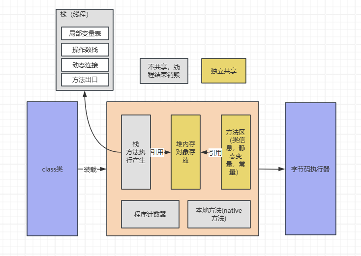

jvm内存结构及内存模型

主要分为五块区域
<!-- @import "[TOC]" {cmd="toc" depthFrom=1 depthTo=6 orderedList=false} -->

<!-- code_chunk_output -->

- [chapter 1](#chapter-1)
  - [section 1.1](#section-11)
  - [section 1.2](#section-12)
    - [section 1.2.1](#section-121)
- [chapter 第二段落](#chapter-第二段落)

<!-- /code_chunk_output -->

# chapter 1
## section 1.1
``` {.line-numbers highlight=1-3}
xxx
zaa
xxx

```



## section 1.2
### section 1.2.1
- xx
- aa
- bb
**ccc**

[边度](http://www.baidu.com)

> wer xx
> xxx

| b   | sss |
| --- | --- |
| >   | 1   |
| 2   | 1   |
| ^   | 3   |


:smile:

:fa-car:

*==**ddd**==*

30^岁^

==xxxxxxxxxxxxxxxxxxxxx==

\(aa+bb+ccc=ssss\)
$$
a * b = c
d * s = f(x)
$$

# chapter 第二段落
``` 
import sys
print('2222')
```
堆，栈，本地方法区，本地方法，程序计数器
 

